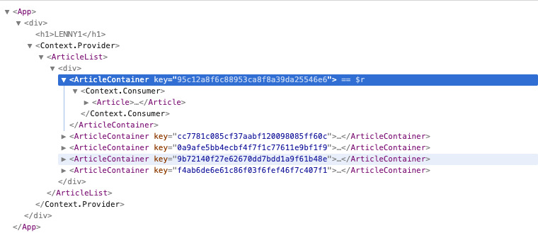
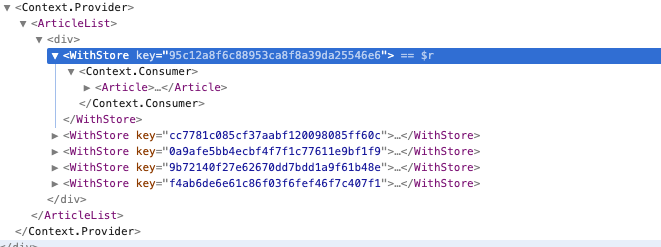

recap on running:
all on seprate processes/terminals

- npm start

- npm run webpack

- npm test

Types and type-checking

When data is invalid, passed down to state then props
React doesn't warn us, and we might not find out

minimum - propTypes

other options

Flow

===

ArticleList doesn't need the store

App -> ArticleList -> Article


===

Context API 

- <StoreContext>

however, it broke our Jest tests
since we are doing tree rendering in our snapshot

instead,use "Shallow rendering" from Enzyme
- only render the ArticleList component
for each, there will be a stub for <Article />

instead of using react-test-renderer,
Enzyme is perfect for shallow rendering
- has kind of similar to jQuery 

* debug Jest test in VSCode
use Jest All config

###############################

2 kinds of organizing context

=== ArticleContainer that wraps Article with a context
5v2



=== HoC WithStore
5v2

function that generates a container component
responsible for extracting the store out of the context object
that doesn't deal directly with the Context API



=== extract store operations from Article
branch: `5v2_b_extra_Props`

1. `extraProps` function that extracts info from store, and puts it along with the (orig) props
2. `export default storeProvider(extraProps)(Article);`
3. in HoC, invoke passed `extraProps` with store from context and props, spreading the result into the output Component

```
    <Component 
        {...props} 
        {...extraProps(store, props)}
        store={store} />
```

this makes the `storeProvider` more flexible
isolates all data access of context from component's presentation