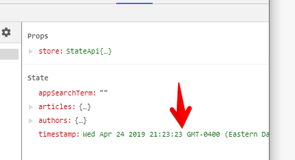

SearchBar
- makes sense to use PureComponent, only update when user types into search bar

TimeStamp
- no need to use PureComponent, we need to actually update every second

but e.g., if we want to only update per minute

1. PureComponent doesnt help, since the value from store updates every second

solutions:
1. change value from store to only update minute
2. or implement `shouldComponentUpdate` to compare this.props vs prevProps if it changed


```
    componentWillUpdate() {
        console.log('Updating search bar');
    }
```


===

always re-renders


why?

SearchBar is being updated every time



state changes every second