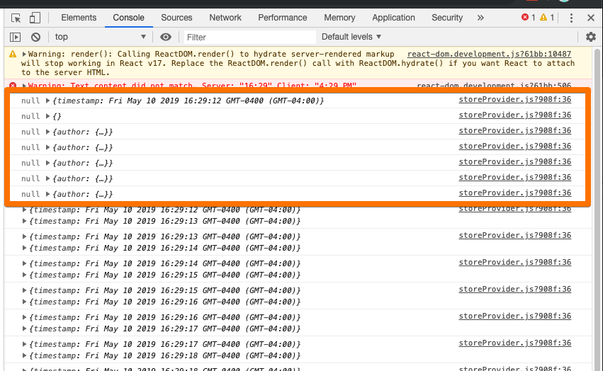
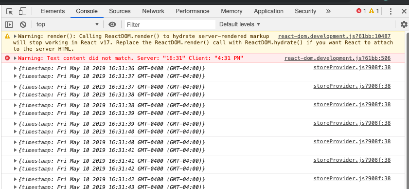
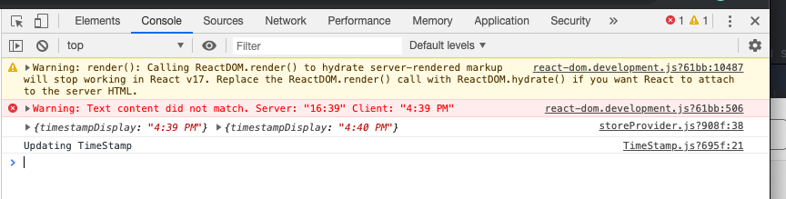

App render method inits state
as full state from the store

but it does not need full store state

more properties on the state changes
causes wasteful re-renders

options

1. customize shouldComponentUpdate

```
  shouldComponentUpdate(nextProps, nextState) {
    return (
      nextState.articles !== this.state.articles
      || nextState.searchTerm !== this.state.searchTerm
    )
  }
```

not the best since there is a dependenct
between shouldComponentUpdate and render


2. subscribe only to a portion of state

```
  appState = () => {
    const { articles, searchTerm } = this.props.store.getState();
    return { articles, searchTerm };
  }
```

timestamp doesnt cause a wastefeul render,
but still works, since it's outside of
the appState

RULE!
alwasy make a connected component subscribe
to part of a state, not all of it
otherwise, it causes a wasteful rerender


Now looking at the Store component

- only TimeStamp component depends on extra props
- forceUpdate updates all

usedState is the extraProps

Use this to see all the updates in state

```
        // inspect what changes in state
        // to find out why the container components are re-rendering
        componentWillUpdate(nextProps, nextState) {
            console.log(this.state, nextState);
        }
```



we can see that the initial state is empty

if we init state from only the used State...
`state = this.usedState();`



we fix the searchBar and article renders,


Timestamp is still a wastfeul rerender,
every second it changes
althoug we only need every minute


1. move logic to TimeStamp container

no need for componentShouldUpdate
```
function extraProps(store) {
	return {
		timestampDisplay: timeDisplay(store.getState().timestamp),
	};
}
```

no more wastfeul operations!
only changes per minute



https://github.com/maicki/why-did-you-update