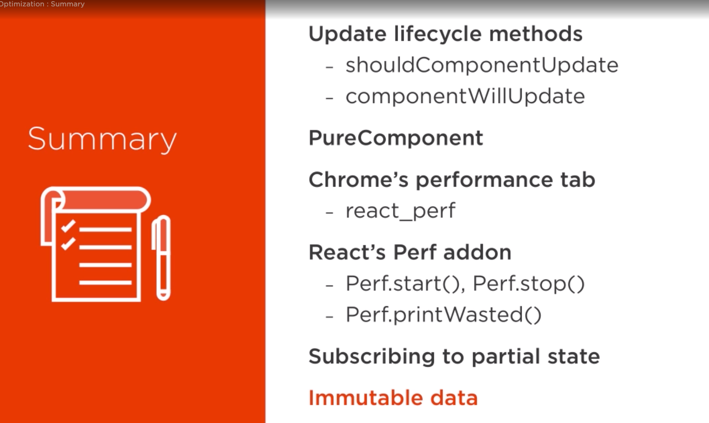

mutable objects in state may be causing problems with PureComponents

try adding this in StateApi.js
this should add a new article
```
		setTimeout(() => {
			const fakeArticle = {
				...rawData.articles[0],
				id: 'fakeArticleId'
			};

			// mutate state
			this.data.articles[fakeArticle.id] = fakeArticle;
			this.notifySubscribers();

		}, 1000);
```
DIDNT WORK!

ArticleList is a PureComponent, article refrence didn't really change


better:

```
			// immutable
			this.data = {
				...this.data,
				articles: {
					...this.data.articles,
					[fakeArticle.id]: fakeArticle,
				}
			}
			this.notifySubscribers();
```
added complexity though to move data around

BEST OPTION:

**immutability-helper**
similar to MongoDB's $set
PureComponent in state and optimizing

https://reactjs.org/docs/update.html


More advanced
**immutable.js** library
like Map, etc

- very optimal way


