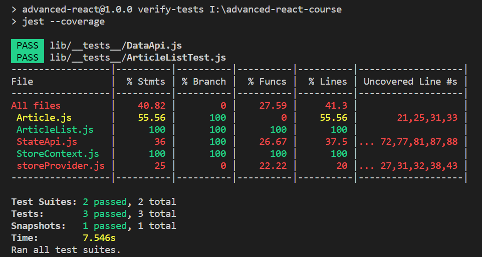

React Production Build

Don't run a dev build in production
React warns you about this a lot

1. CI and Testing

Green build

Automate the test check
options:

- using Git hooks
  exec script before/after commit, push, receive
  CONS: large test suite will take long

- Travis CI
  async tests
  runs test for every pushed

how much of the code is tested?
-> use Jest coverage

add this to package.json
`"verify-tests": "jest --coverage"`

`npm run verify-tests`

result:

creates a `/coverage` dir
add this to `.gitignore`

☝ TIP: keep tests to 100% coverage all the time

e.g. fail when lower coverage

2.
