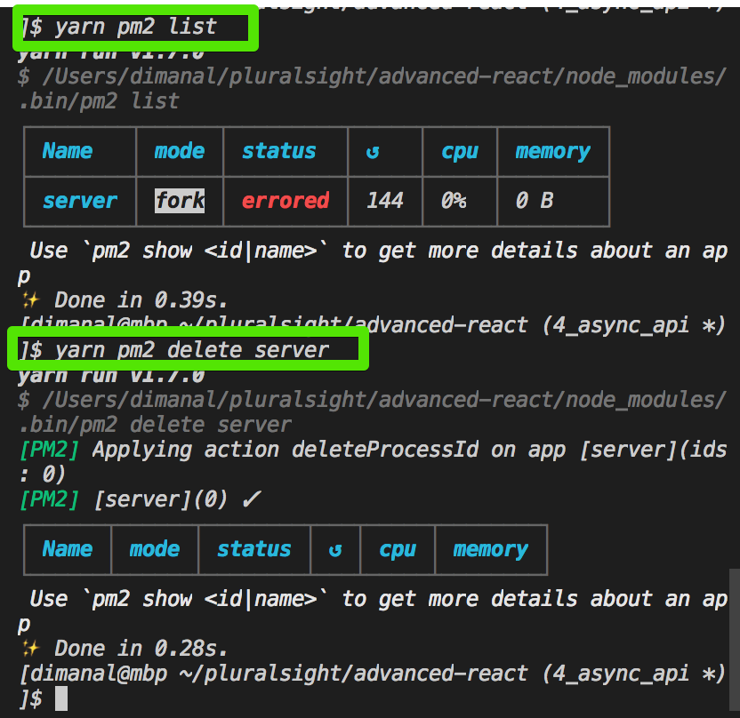

$ yarn dev

http://pm2.keymetrics.io/docs/usage/quick-start/

# try this first
$ pm2 stop all

# if does not work, already running or address already in use
ps aux | grep node
ps aux | grep pm2

lsof -i tcp:<PORT NUMBER>  <---
kill -9 PID

$ yarn pm2 logs

$ yarn pm2 list
$ yarn pm2 delete <server_name>

