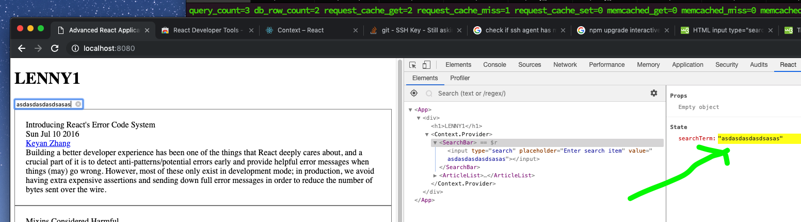

so far we init. state with some data
and used Context and HoC to propagate data to components

app just loads data, no changes yet

but we haven't changed it yet

=====

1. internally, using setState


2. externally


===== Uncontrolled vs controlled components

Uncontrolled
1. callback refs
2. rgular refs

controlled components
- sync with state

one advantage with React Dev Tools



====
debounce the typing so state won't change on every key typed by user
- simple implementation of debounce

setState async
- execute search async after setState by:

```
setState({
    data: newData
}, () => {
    // do something asyn after state is updated
})
```

- function prop from App -> SearchBar
-- init `appSearchTerm` in StateApi to ''
-- update using a function prop passed to SearchBar

- implement search using filter

next: changes only applied to internal state in App
        so we have to also apply changes to external Store

        why? its better to manage data in an external Store
                so we don't have a lot of data logic in one React component


