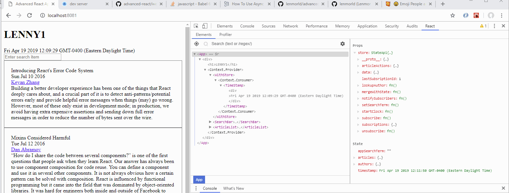

so far we init. state with some data
and used Context and HoC to propagate data to components

app just loads data, no changes yet

but we haven't changed it yet

=====

1. internally, using setState


2. externally


===== Uncontrolled vs controlled components

Uncontrolled
1. callback refs
2. rgular refs

controlled components
- sync with state

one advantage with React Dev Tools


====
debounce the typing so state won't change on every key typed by user
- simple implementation of debounce

setState async
- execute search async after setState by:

```
setState({
    data: newData
}, () => {
    // do something asyn after state is updated
})
```

- function prop from App -> SearchBar
-- init `appSearchTerm` in StateApi to ''
-- update using a function prop passed to SearchBar

- implement search using filter

next: changes only applied to internal state in App
        so we have to also apply changes to external Store

        why? its better to manage state in an external Store
                so we don't have a lot of data logic in one React component


=== Data subscription

- Components get data and are subscribed to an external store
- StateApi can be an event emitter
    Components listen to this, and invoke a callback

    must ubscubscribe on component unmount, since this is an Active Listener    

*Vanilla Flux works like this, an event emitter


=== Timestamp

assume that the timestampis needed in state, reused throughout the app
(since Timestamp can simply be generated inside the component itself)
-> use HoC that gives context


can we also make the container component (WithStore) a PureComponent ?
- we are getting the initial value
- time stops updating! even though the global State updates the time

-> solution: HoC Container should also subscribe to store changes, 
            but with direct access to context



- putting thins in store have performance impacts


=> Redux is a more complete solution to these
and will help you solve these problems tha we had to solve


